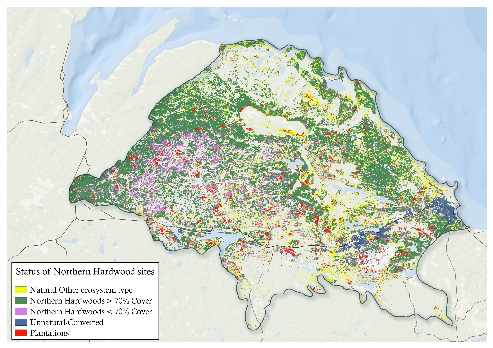

## Introduction
While LANDFIRE's Vegetation Departure set is robust and illustrative at large extents, it was not designed for use at small extents, and due to "improvements" (i.e., changes in methods) may or may not be useful when comparing across versions.

We propose exploration of other approaches with these notes:

* it may not be possible to use a data-driven approach for small parcels
* expert opinion may be an option
* some preserves were created for single species or a small assemblage of species...not for protection of an ecosystem.  It may be necessary to try and split those preserves out
* LANDFIRE data may be useful for larger extents

## Level of degredation example
Do what the Michigan Chapter has done: develop rulesets to apply to combinations of LANDFIRE data. More specifically, for a landscape of interest they noted:

* it was dominated by Northern Hardwoods
* that ideally this ecosystem would be mostly tall trees, with canopy coverage > 70%
* there has been a history of plantations and heavy removals of trees within this ecosystem

With these "rules" we combined LANDFIRE Biophysical Settings, Existing Vegetation Cover/Height/Type data and applied these rules to create a "degraded map" of the Northern Hardwoods within the landscape.

**Degradation level of Northern Hardwoods in the Michigamme Highlands of upper Michigan**

```{r, echo=FALSE, out.width= "100%"} 


```

## What about the entire country?

We think that it could be possible to create a general set of "rules" that would be more generalized than VDEP, and could be more informative if refined and reviewed.  More specifically we would:

* Create canopy attribute rules per groups of ecosystems (most likely by fire regime characteristics; could also add in deciduous and/or coniferous, etc. to stratify)
* Combine necessary data, apply rulesets
* Review

## Conceptual examples
The examples below would need review and refinement, but might help illustrate the concept:

* Prairies: any vegetation except herbaceous is suspect, all invasives bad.  For remaining grassland ecosystem scale depredation by level of shrubs and trees
* Fire dependent deciduous (e.g., oak-hickories): canopy cover over 70% is bad.  Conversion to maples bad.  Scale degredation by canopy cover and level of conversion.
* Shrub ecosystems out west, non-fire dependent: look to level of invasive herbaceous, and possibly fuel loading.  Scale by invasives and particular fuel types.  


