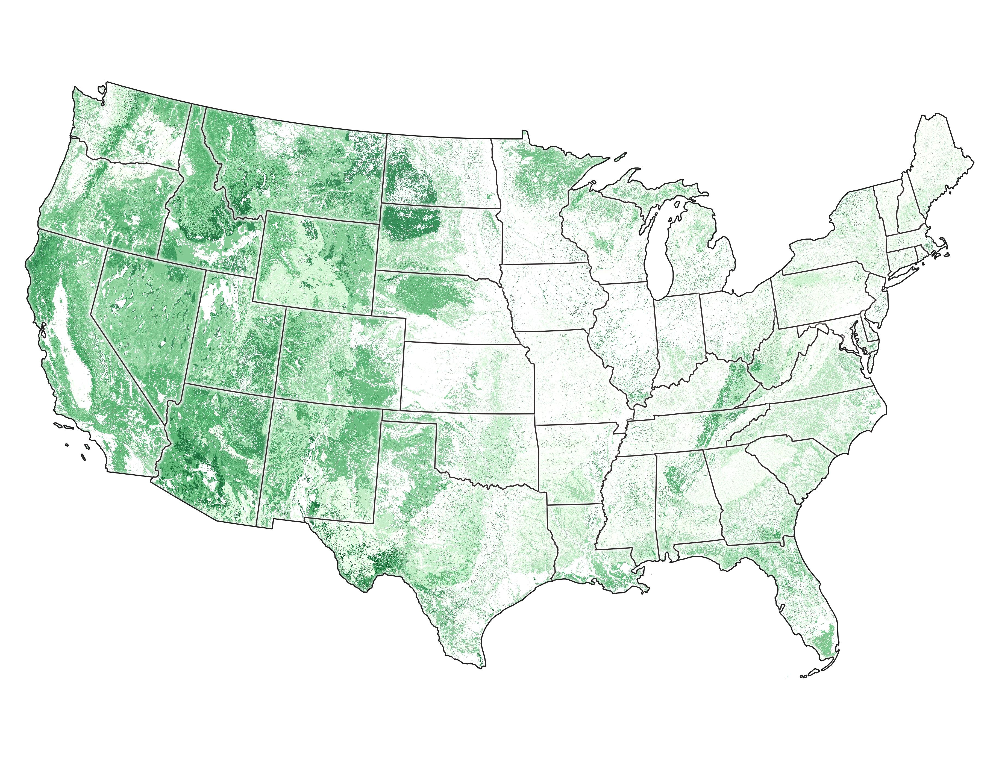

## This site...

was built in R-Studio with the [workflowR](https://jdblischak.github.io/workflowr/articles/wflow-01-getting-started.html#overview) package as a way to: 

1. explore the potential of using LANDFIRE's [Vegetation Departure](https://www.landfire.gov/vdep.php) Dataset for TNC (and other) parcels
2. demonstrate using a website to share code, data and outputs
3. prompt more discussion about how to measure ecological condition

<br> 
<br> 
**Map of VDEP.  Darker greens indicate areas where vegetation structure is closest to reference conditions.**
```{r, echo=FALSE, out.width= "100%"} 


```

